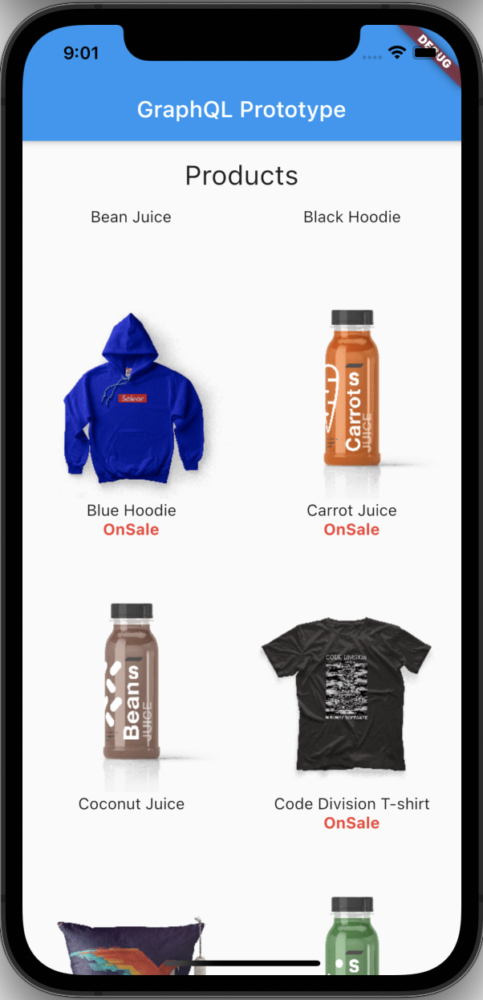

# Flutter GraphQL Store application prototype.

This is a Flutter project to test the GraphQL integration in Flutter. This is a simple application that list's products from an public GraphQL API.

  

